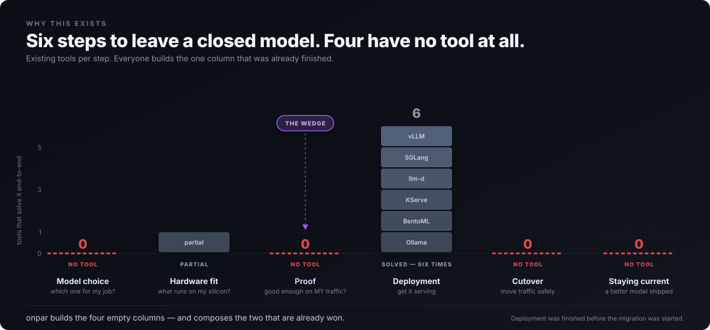
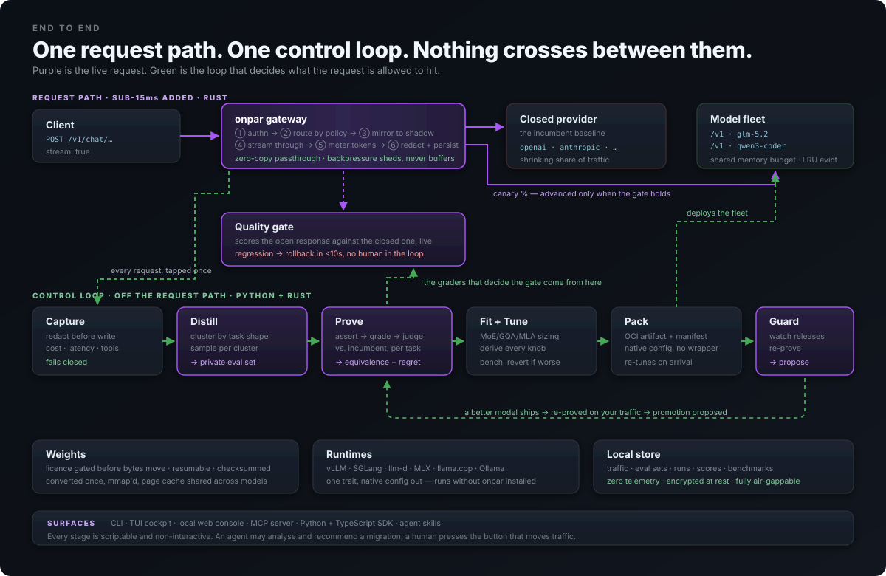

<div align="center">



# Open weights are free.<br>Running them properly is the hard part.

### One command. You never write a config. Agents drive it natively.

**Between "the weights are on Hugging Face" and "it's serving production" sits a
project: size a KV cache without getting MoE, GQA or MLA wrong, pick among five
engines, get the two dozen flags that matter right, deploy it, and still have no
way to say whether
the model is actually good enough for *your* traffic. clickllm collapses that
into one decision — and prints the arithmetic behind every number in it.**

[](docs/50-roadmap.md)
[](#verification)
[](LICENSE)
[](https://dshakes.github.io/clickllm/docs/)

**[Site](https://dshakes.github.io/clickllm/) · [Docs](https://dshakes.github.io/clickllm/docs/) · [Agent-first](#agent-first-by-construction) · [Why](#why-this-exists) · [Quickstart](#try-it-in-ten-seconds) · [Roadmap](docs/50-roadmap.md)**

</div>

---

## Try it in ten seconds

```bash
uvx clickllm fit --context 32k --concurrency 8
```

```
  M4 Max · 16 cores · 128 GB · 546 GB/s          usable for inference: 96 GB

  model                     quant   weights      kv   total    free  ~tok/s  license
  ----------------------------------------------------------------------------------
  Qwen3 30B-A3B (MoE)       q8        28.4G   24.0G   56.2G   39.8G     119  Apache-2.0
  Phi-4 14B                 q8        13.7G   50.0G   66.3G   29.7G      27  MIT

  NOT FEASIBLE
  Kimi K3 (2.8T MoE)        weights alone need 1,467 GB at q4 — MoE sparsity
                            (50B of 2800B active) cuts compute, not memory
```

Then ask the inverse — *what would I need to run this?*

```bash
uvx clickllm where deepseek-v3 --context 16k
```

```
  hardware                  quant     total  ~tok/s    $/hr   $/Mtok
  ------------------------------------------------------------------
  8× NVIDIA H200            fp8      677.4G     649   28.80    12.32
  Apple M3 Ultra 512 GB     q4       382.1G      28       -        -

  WILL NOT RUN
  NVIDIA H100 80 GB SXM     weights alone need 352 GB at q4, 72 GB usable
```

Every number answers `--explain`, which prints the arithmetic that produced it.

---

## Agent-first, by construction

Most tools ship a CLI and bolt on an agent wrapper. Here the CLI, the MCP server,
the Python SDK and the agent skill are **four faces of one implementation** — an
agent gets the same answer you do, with the same arithmetic attached, because it
is calling the same code.

```jsonc
// clickllm-mcp — JSON-RPC over stdio, zero dependencies
clickllm_fit       // what runs on this machine, at this context and concurrency
clickllm_explain   // the full arithmetic behind one verdict — weights, KV, headroom
clickllm_prove     // run the eval suite: verdict, traffic split, and a receipt
clickllm_advise    // what to change unprompted, and where production diverged
clickllm_catalog   // parameters, MoE split, context, licence
```

**The read-only boundary is a test, not a promise.** The suite asserts that no
exposed tool name contains `cutover`, `apply`, `promote`, `advance`, `rollout`,
`deploy`, `serve` or `route` — so an agent can size, compare, *run the whole
evaluation* and recommend a migration, and **structurally cannot** be the thing
that moves production traffic. Add such a tool and the build fails. The
vocabulary is deliberately broad: the failure it guards against is someone
adding a helpful-looking `clickllm_promote` and nothing objecting.

**It tells you what you didn't ask.** A planner that only answers the question
asked is a form. Somebody deploys an agent fleet with a 2,000-token system prompt
on every request, never sets a prefix-sharing figure because no form demanded one,
and pays to recompute the same prefix a million times. The plan was correct — and
40% more expensive than it needed to be, with nothing saying so.

```bash
clickllm advise --context 128k --concurrency 16 --seen-concurrency 40
```
```
  PRODUCTION DIVERGED FROM THE PLAN

  [high] Re-plan for concurrency 40.
    because: the plan assumes 16 in-flight requests; production is running 40.
             KV cache, batch limits and the speculative decision were all
             derived from the smaller number.
    expect:  settings that match the traffic.
```

Feed it real telemetry and it reconciles what production *did* against what the
plan *assumed* — the self-healing seam. Every item carries the observation that
triggered it, so a wrong suggestion is dismissible rather than mysterious, and
every effect is labelled an estimate. It proposes; it never applies.

**You never write a config.** Not a YAML you fill in, not a template you fork —
you state the intent and it derives the engine and the flags. What it emits is a
real `vllm serve` or a real `InferencePool` that **runs with clickllm uninstalled**.
Abstraction that would trap you isn't abstraction, it's a dependency.

**Nothing leaves the machine.** Zero telemetry, zero egress, no account. Your
production prompts are the most sensitive data you have; export is a command you
run, never a sync that happens.

---

## Why this exists

The ecosystem is excellent at the last mile and absent at the first. vLLM and SGLang
serve brilliantly *once you know what to serve, on what, with which flags* — and
every one of those is a research task the docs assume you've already done. So the
work falls to whoever on the team has time, and it gets done from half-remembered
blog posts.

Ask any staff engineer whether an open model could handle most of their traffic and
they'll say yes. Ask them to bet the product on it and they'll stop — correctly.
**Nothing turns that instinct into evidence.**

| What you'd need | Closest tool | Why it stops short |
|---|---|---|
| To know what your hardware can run | spreadsheets, vibes | MoE, GQA and MLA each size differently; getting MLA wrong overestimates by ~50×. |
| A benchmark of *your* workload | promptfoo, Inspect AI | Both start from a test set you hand-write. Yours doesn't exist. |
| A verdict you'd act on | LM Studio side-by-side | One prompt at a time, judged by eye. |
| Your traffic, analysed | LiteLLM | Proxies every request. Does nothing with them. |
| A safe cutover | Any gateway | Canaries on **errors**. Not one gates on **quality**. |
| To stay current | — | You find out on Twitter, then redo the work by hand. |



Everyone builds the one column that was already finished.

---

## The output is a decision, not a dashboard

```
REGRET — keep the incumbent for these:
  long-ctx refactor  (15% of traffic)  30% [22–40]

                        codegen  long-ctx refacto      rare-json
                          (60%)             (15%)          (25%)
  ──────────────────────────────────────────────────────────────
  glm-5.2           96% [90–98]       30% [22–40]  100% [44–100] ⚠   87% weighted
  ──────────────────────────────────────────────────────────────
  gpt-5 (incumbent)        100%              100%           100%

judge: claude-opus-5, position-swapped · human agreement 0.90 (n=40)
⚠ underpowered clusters (too few samples to conclude): rare-json
⚠ 2 items had no applicable grader and are excluded, not counted as passes

Move 60% of traffic to glm-5.2.
  Keep the incumbent for: long-ctx refactor
  Not yet proven (gather more evidence): rare-json
  Saving: $1,582/mo (56%) at zero measured quality loss
```

That output is one command over an eval set you never wrote:

```bash
clickllm prove evalset.json --candidate glm-5.2 --incumbent gpt-5 --out receipt.json
```

The eval set comes from your own captured traffic, clustered by task shape — which
is the whole reason it exists. Every other tool starts from a test set you author,
and nobody has one, because writing it *is* the work you were trying to avoid.

Four things there are deliberate, and each corrects how these comparisons usually get presented:

- **`100% [44–100] ⚠`** — a perfect score on three samples is not certainty. Wilson intervals, so a 95% gate can't open on noise.
- **Regret above the fold** — where the candidate loses is printed *first*. The honest failure is what makes the wins credible.
- **"Not yet proven" ≠ "regressed"** — thin evidence means *gather more*, not *give up*. Conflating them strands traffic on the incumbent forever.
- **No cost rate → no saving printed.** A fabricated saving is the most damaging number this report could contain.

And two the suite enforces underneath:

- **35 clean samples before a cluster can move.** A 0.90 bar needs the whole Wilson
  interval above it, and 34 perfect items do not clear it. The exact boundary is
  pinned by a test, because it is the number that decides whether traffic moves.
- **The judge is the last resort, not the first.** Deterministic graders run first,
  and an item they *disqualify* never reaches the judge — paying a model to
  re-confirm that malformed JSON is malformed is spend with no information in it.
  It also means a judge outage costs you graded items, not the run.

---

## What runs today

| | Capability | |
|---|---|---|
| ① | **Observe** — capture, redaction that fails closed, encrypted store | ✅ |
| ② | **Distill** — structural clustering, representative sampling | ✅ |
| ③ | **Fit** — MoE/GQA/MLA-correct sizing, 17 hardware classes, `--explain` | ✅ |
| — | **Plan** — engine *and* flags derived from what the deployment is for | ✅ |
| — | **Advise** — `clickllm advise`: what to change unprompted, and drift against real telemetry | ✅ |
| — | **Intent** — a sentence in, a plan out; asks about what it cannot infer | ✅ |
| ④ | **Prove** — `clickllm prove`: grader stack, position-swapped judge, equivalence matrix | ✅ |
| — | **Receipt** — a portable, reproducible proof you can hand to an auditor | ✅ |
| ⑤ | **Deploy** — native vLLM / SGLang / llm-d config, inference in a box | ✅ |
| ⑥ | **Gateway** — SSE streaming, metering, router, real shadow dispatch | ✅ |
| — | **Gate** — automatic rollback, human-gated advance, live control surface | ✅ |
| — | **Telemetry** — KV pressure, prefill/decode split, plan-vs-reality check | ✅ |
| ⑦ | **Guard** — model drift, traffic drift, re-prove proposals | ✅ |
| — | **Post-training** — distil from your own captured incumbent output | ✅ |
| — | **Surfaces** — CLI · MCP · Python SDK · agent skill · local console · native launcher | ✅ |
| — | **Targets** — systemd unit · `docker run` · Kubernetes Deployment, each standalone | ✅ |
| — | **Silicon** — NVIDIA · AMD · Apple · **TPU v5e/v6e/v5p**, sized per host | ✅ |
| — | **Host stats** — foreign GPU memory the engine cannot see | ✅ |
| — | **Kernel seam** — scaffold a vLLM plugin, and a plan that *proves* it helped | ✅ |

Full acceptance criteria and risk gates: **[implementation plan](docs/80-implementation-plan.md)**.

---

## Prove it, then move it

The motto is the control flow. Nothing skips a step, and each step can say *no*.


**Proof is an artifact, not a dashboard.** A receipt is a file: every claim with
its confidence interval, the bar it was measured against, the judge and how much
it agreed with humans, and — required, never optional — the clusters that did
*not* pass. Re-run the same eval set and the digest must match, which is a
stronger claim than a signature. A signature says *we said this*; reproduction
says *and it is true*, and anyone holding the eval set can check it.

**Moving is asymmetric.** Rollback is automatic and deliberately easy to trigger.
Advancing is only ever a proposal — the gate says the evidence supports 25%, a
human moves it. The control surface re-derives that rule from the numbers alone,
so the automation can be wrong or bypassed and traffic still cannot escalate
unattended.

**Then it keeps checking.** The guard separates three things every other tool
collapses into one "stale" flag: the model changed behind its name (your proof is
void), your traffic moved (the eval set answers questions nobody asks now), or
something new was released (your proof is still true). Only the first two mean
you no longer know whether production is adequate.

---

## Three things everyone gets wrong

The docs teach the whole inference stack from first principles — [start here](https://dshakes.github.io/clickllm/docs/#edu-why) if you've never sized a KV cache. The short version:

**① MoE sizes on *total* parameters.** Kimi K3 activates 50B of 2.8T per token, so people assume it needs 50B of memory. All 2.8T must be resident. *Sparsity cuts compute, not memory.*

**② GQA uses `kv_heads`, not attention heads.** Using attention heads overestimates KV cache by up to 8×.

**③ MLA has a different formula entirely.** DeepSeek-family models compress K and V into one low-rank latent. Applying the GQA formula overestimates by ~50×.

And one that costs money in the other direction: **speculative decoding turns negative past batch ~32.** EAGLE-3's headline "2–3×" is a single-stream figure.

---

## Architecture



Purple is the live request. Green is the control loop deciding what it's allowed to hit. **They never cross.**

**Rust** for the datapath and weights path — no GC pauses against a p95 budget, explicit accounting for GB-scale fleet memory. **Python** for the control plane, where the ML ecosystem lives. Reasoning and rejected alternatives in [ADR-0007](docs/adr/0007-tech-stack.md).

---

## Install

```bash
uvx clickllm fit                        # no install
pipx install clickllm                   # or
brew install dshakes/tap/clickllm       # or
docker run --rm ghcr.io/dshakes/clickllm:latest fit
curl -fsSL https://dshakes.github.io/clickllm/install.sh | sh
```

**Native launcher** — `clickllm desktop install` writes a real `.app` on macOS or a
`.desktop` entry on Linux. It launches `clickllm ui` rather than reimplementing it,
binds loopback only, and reopens the running instance instead of clashing if you
double-click twice. `clickllm desktop uninstall` removes it.

**Python SDK** — the same implementation the CLI and MCP server route through:

```python
from clickllm import sdk
report = sdk.fit(context="32k", concurrency=8)
report.best()                 # highest-capability candidate that isn't slow
report.commercially_clean()   # permissive licence AND verified architecture

result = sdk.prove(items, shares=shares, issued="2026-07-27")
result.policy.moved_share     # 0.75 — what the evidence supports moving
result.policy.regret_clusters # ('rare-json',) — where it loses, always named
result.receipt.digest()       # reproducible: same eval set, same digest
```

**MCP server** — `clickllm-mcp`, JSON-RPC over stdio, zero dependencies. Deliberately read-only: an agent may analyse and recommend a migration; a human presses the button that moves production traffic.

---

## Verification

```bash
cargo test --all                                   # 249 Rust
cargo clippy --all-targets -- -D warnings
uv run --with pytest --python 3.13 pytest -q       # 333 Python
```

**582 tests.** Eight of the Python tests exercise the PyO3 bridge and skip unless
the extension is built — `maturin develop` in `clickllm-core/` turns them on. The Rust core denies `unwrap`/`expect`/`panic!`/slice-indexing at the lint level — a sizing or licence bug must not be a panic. Gateway tests run over **real TCP** against a **real** upstream, because a test that calls the handler directly passes even when the response is buffered.

**Every engine flag is verified against published docs, never recalled.** That
rule exists because breaking it shipped a bug: `--guided-decoding-backend` had
been renamed in vLLM, so every structured-output config this repo generated was
unrunnable. Where a flag could not be confirmed — SGLang's grammar backend at the
time of writing — the adapter reports a gap rather than emitting a plausible
guess. A wrong flag fails loudly and costs an afternoon; a *right-looking* flag
with inverted meaning succeeds and quietly costs half your throughput.

Four defects caught by review or by rendering, all now regression tests:

- an SSE frame cap that was *detected* but never *enforced*
- shadow mirroring recorded and displayed without ever dispatching
- failover that would serve **unproven candidate output during shadow mode** —
  the phase whose entire contract is "scored, never served"
- concurrent capture appends interleaving into a log that decrypted as garbage

---

## Principles

1. **Kiosk outside, glass box inside.** One command; every number drillable to the raw prompt.
2. **Show the arithmetic.** `--explain` on everything.
3. **Lead with the regret.** Honest failures buy credibility for the wins.
4. **Never a number without its confidence.** `?` beats a fabricated score.
5. **Local-first, zero telemetry.** Your production prompts are the most sensitive data you have.
6. **No lock-in, by construction.** Eval sets export. Generated config runs standalone. *A product about escaping lock-in cannot create lock-in.*

---

## Docs

| | |
|---|---|
| [00 — Verdict](docs/00-verdict.md) | Build vs. buy, honestly. |
| [10 — Landscape](docs/10-landscape.md) | 14 competitors across 4 layers. |
| [20 — PRD](docs/20-prd.md) | Goals, personas, FR/NFR, epics, risks. |
| [30 — Architecture](docs/30-architecture.md) | Datapath/control-plane split, grader stack, fit math. |
| [40 — UX](docs/40-ux.md) | CLI, TUI, console, MCP. |
| [80 — Plan](docs/80-implementation-plan.md) | M0–M10, acceptance criteria, risk gates. |
| [ADRs](docs/adr/) | Eight decisions, including the two later reversed. |

## Prior art

**[LiteLLM](https://github.com/BerriAI/litellm)** provider transport · **[Inspect AI](https://inspect.aisi.org.uk)** eval runner · **[vLLM](https://github.com/vllm-project/vllm)** · **[SGLang](https://github.com/sgl-project/sglang)** · **[llama.cpp](https://github.com/ggerganov/llama.cpp)** · **[MLX](https://github.com/ml-explore/mlx)** · **[llm-d](https://llm-d.ai)** + **[GAIE](https://github.com/kubernetes-sigs/gateway-api-inference-extension)** · **[Ollama](https://ollama.com)**, the ergonomics bar everyone should be held to.

## License

Apache-2.0.
