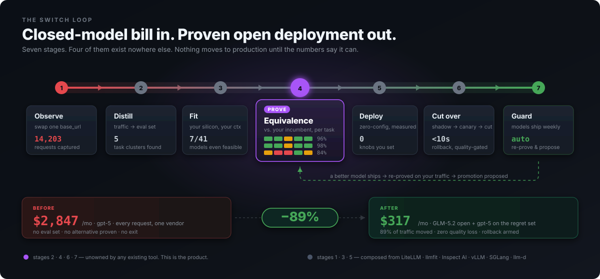
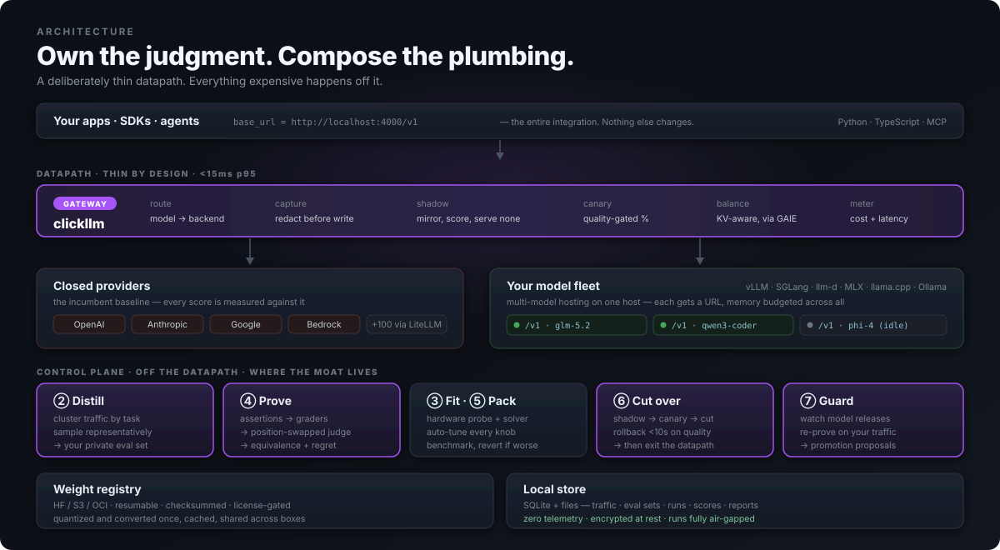

<div align="center">

# clickllm  <sub><sub>→ proposed: **Parity**</sub></sub>

**Prove which open model can replace your closed one — on your traffic, your hardware, your budget. Then move you there without a risky cutover.**

[](docs/50-roadmap.md)
[](LICENSE)
[](pyproject.toml)
[](pyproject.toml)

**Prove it, then move it.**

[Why](#the-problem) · [Quickstart](#quickstart) · [How it works](#the-switch-loop) · [Architecture](#architecture) · [Roadmap](docs/50-roadmap.md) · [Pitch](docs/60-pitch.md) · [Naming](docs/70-naming.md)

</div>

---



---

## The problem

Open models caught up. **Migrations didn't.**

A team paying $18K/month to Anthropic knows GLM-5.2 is MIT-licensed and probably good enough. They don't switch, because "probably" is not something you bet a production system on — and nothing turns "probably" into evidence.

The blocker was never deployment. Ollama solved deployment in 2023. The blocker is that **no tool can tell you whether an open model is good enough for *your* job**, and every tool that could is structurally disincentivized from trying:

| You need | The tool that's closest | Why it doesn't get you there |
|---|---|---|
| An eval set for your workload | promptfoo, Inspect AI | Start from a test set *you* hand-write. Yours doesn't exist. |
| To know if it's good enough | LM Studio side-by-side | One prompt at a time, by hand, eyeballed |
| Your traffic analyzed | LiteLLM | Sees every request. Does nothing with them. |
| A safe cutover | Any gateway | Canaries on **errors**. Nobody gates on **quality**. |
| To stay current | — | You find out on Twitter, then redo the work by hand |


Everyone builds column 4. It's the only column with incumbents.

---

## Quickstart

> **Pre-alpha.** Stage ③ works today. Stages ①②④⑤⑥⑦ are specified, not built — see the [roadmap](docs/50-roadmap.md). This README describes the target; the table below marks what runs.

```bash
git clone https://github.com/<you>/clickllm && cd clickllm
uv run --python 3.13 python -m clickllm.cli fit --context 32k --concurrency 8
```

```
  M4 Max · 16 cores · 128 GB · 546 GB/s
  usable for inference: 96 GB
  raise to ~118 GB with: sudo sysctl iogpu.wired_limit_mb=120586

  FEASIBLE at 32,768 context, concurrency 8

  model                     quant   weights      kv   total    free  ~tok/s  license
  ----------------------------------------------------------------------------------
  Qwen3 32B                 q4        17.2G   64.0G   84.1G   11.9G      21  Apache-2.0 OK
  Qwen3 30B-A3B (MoE)       q8        28.4G   24.0G   56.2G   39.8G     119  Apache-2.0 OK
  Mistral Small 24B         q8        22.0G   40.0G   65.2G   30.8G      17  Apache-2.0 OK
  Phi-4 14B                 q8        13.7G   50.0G   66.3G   29.7G      27  MIT OK
  Llama 3.1 8B              q8         7.5G   32.0G   41.6G   54.4G      49  Llama 3.1 !

  NOT FEASIBLE
  Kimi K3 (2.8T MoE)        weights alone need 1,467 GB at q4 — MoE sparsity
                            (50B of 2800B active) cuts compute, not memory

  runtime -> vllm-mlx
             continuous batching on Metal; at concurrency 8 aggregate throughput
             dominates, despite ~15% lower single-stream than llama.cpp
```

Every number is auditable:

```bash
python -m clickllm.cli fit --explain qwen3-30b-a3b --concurrency 8
```

```
  weights   30.5B params x 8 bits / 8      =   28.4 GB   (MoE: ALL experts resident)
  kv cache  98,304 B/tok x 32,768 x 8      =   24.0 GB   (GQA)
  overhead  8% of weights + 1.5 GB floor   =    3.8 GB
  --------------------------------------------------------------
  required                                     56.2 GB
  usable                                       96.0 GB
  headroom                                     39.8 GB

  decode is bandwidth-bound: 3.1 GB read/token (3.3B active) at 72% of peak
  ~119 tok/s single-stream (roofline estimate, not measured)
```

---

## The Switch Loop

Seven stages. Each is an **agent with tools** — conversational, resumable, and able to skip ahead when the answer is already known. `clickllm switch` drives all seven and asks only when it genuinely can't decide.

| | Stage | What happens | Status |
|---|---|---|---|
| ① | **Observe** | Swap `base_url`. We proxy to your current provider, capture traffic, redact PII **before** it touches disk. Useful day one as a cost dashboard. | planned |
| ② | **Distill** | Cluster prompts by task shape. Sample representatively. Your recorded closed-model outputs become the *incumbent baseline*. **← moat** | planned |
| ③ | **Fit** | What runs on your silicon, at the context and concurrency stage ② observed you actually use. MoE/GQA/MLA-correct, every number auditable. | **works** |
| ④ | **Prove** | Grade candidates against your eval set: assertions → task graders → position-swapped pairwise judge. **← the hero** | planned |
| ⑤ | **Deploy** | **Zero-config.** Name a model and a target; every knob — quantization, spec-decode, caching, parallelism, batch limits — is auto-tuned from your hardware and traffic, then *measured* and reverted if it doesn't help. The native config it writes is a receipt, not a form to fill in. | planned |
| ⑥ | **Cut over** | Shadow → canary → cut, gated on **quality**, auto-rollback in <10s. **← moat** | **partial** — router, streaming datapath and token metering ship; the quality gate is next |
| ⑦ | **Guard** | New model ships → re-run *your* evals → propose a promotion with the cost/quality delta. **← moat** | planned |

### The output that matters

```
                    codegen   tools   long-ctx   summar.   classify   ~cost
                     (38%)    (24%)     (11%)     (19%)      (8%)
  ──────────────────────────────────────────────────────────────────────────
  GLM-5.2 Q4          96 ██   91 ██    62 ▓▒     99 ██     100 ██    $210/mo
  Kimi-K2.7-Code      98 ██   94 ██    71 ▓█     95 ██     100 ██    $180/mo
  Qwen3.6-27B Q8      84 ▓█   79 ▓█    55 ▒░     97 ██     100 ██    $140/mo
  ──────────────────────────────────────────────────────────────────────────
  gpt-5 (incumbent)  100      100      100       100       100      $2,847/mo

  ▸ REGRET: long-context multi-file refactor (11% of traffic)
    All candidates degrade past 18K context. Keep gpt-5 for this cluster.
    Hybrid saves $2,530/mo (89%) at zero quality loss.

  judge: claude-opus-5, position-swapped · human agreement 0.89 (n=40)
```

Columns are **traffic-weighted** — a cluster that's 38% of your load matters 5× one at 8%. The incumbent is pinned at 100 because nobody cares about absolute quality, only whether switching is a downgrade. **Regret sits above the fold**, because the honest failure is what makes the wins credible.

---

## Architecture



**We own the judgment. We compose the plumbing.**

| Build (the moat) | Compose (already won) |
|---|---|
| Traffic → eval-set distillation | [LiteLLM](https://github.com/BerriAI/litellm) — provider transport |
| Grader stack + equivalence matrix | own hardware detection + catalogue (M0) |
| Regret analysis + hybrid policy | [Inspect AI](https://inspect.aisi.org.uk) — eval runner |
| Quality-gated migration router | vLLM · SGLang · llama.cpp · MLX · MLC |
| Hardware-aware config generation | [llm-d](https://llm-d.ai) + [GAIE](https://github.com/kubernetes-sigs/gateway-api-inference-extension) — production routing |
| Drift watch + promotion proposals | KServe · BentoML — k8s serving targets |

We do **not** build: an inference engine, a production load balancer, a chat UI, a RAG framework, fine-tuning, or hosted inference. Every one has a well-funded incumbent, and none is the gap.

### Inference in a box

```bash
clickllm pack --model glm-5.2 --out triage.box     # tuned, benchmarked, portable
clickllm push ghcr.io/acme/triage:v3               # standard OCI — any registry, signable
clickllm run  ghcr.io/acme/triage:v3               # OpenAI-compatible endpoint, any hardware
```

**One OCI artifact, one registry, one command, one endpoint.** It runs *as* a container on Linux, Windows/WSL2, and Kubernetes. On macOS the same artifact is pulled and a native MLX engine is supervised against it — because [no mechanism exists to reach the Apple GPU from a Linux container](docs/adr/0005-inference-in-a-box.md): the GPU is on-die behind unified memory, Metal has no Linux driver, and Apple ships no compute passthrough. One platform, one binding difference, invisible unless you ask.

The box is a tuned starting point **plus the evidence behind it** — not a frozen command line. On arrival it re-profiles the host, re-solves if the hardware differs from where it was packed, re-benchmarks, reverts what doesn't help, and tells you what it changed. A box packed on an A100 that lands on a 24 GB L40S re-quantizes instead of OOM-ing.

**We own every knob.** Composing the engines doesn't mean exposing them. You never write a `vllm serve` line or pick a `num_speculative_tokens`:

| Auto-tuned | Derived from |
|---|---|
| quantization | memory solve, re-validated against your evals |
| speculative decoding + draft length | observed concurrency — **disabled** past the acceptance cliff, where it makes you *slower* |
| prefix / radix caching | measured prefix-sharing rate in your traffic |
| tensor + pipeline parallelism | device count and topology |
| `max_model_len`, `max_num_seqs`, chunked prefill | your p95 context — not the model's advertised max |
| KV dtype, memory utilization | headroom after the solve |

Each choice is benchmarked against your workload and **reverted if it doesn't actually help on your hardware**. Estimates pick the candidates; measurement ratifies them.

---

## Hardware

Dev is Apple Metal; prod is CUDA. They share nothing but the OpenAI wire format — so the runtime is a swappable backend from commit one ([ADR-0002](docs/adr/0002-runtime-abstraction.md)).

| Target | Detected | Recommended runtime | Notes |
|---|---|---|---|
| Apple Silicon (M1–M5) | unified memory, bandwidth, wired limit | **vllm-mlx** (concurrency ≥4) · **llama.cpp Metal** (single-stream) · **MLC-LLM** (64K+ ctx) | vLLM/SGLang/llm-d **do not run here** — CUDA-first |
| Single NVIDIA GPU | VRAM, count | **vLLM** + EAGLE-3, or **SGLang** at concurrency ≥8 | RadixAttention wins on agent traffic with shared prefixes |
| Multi-GPU / cluster | per-device VRAM, node inventory | **llm-d + GAIE** | disaggregated prefill/decode; measured 3× tok/s, 2× TTFT reduction |
| CPU only | RAM, cores | llama.cpp | honest about single-digit tok/s |

Sizing is MoE-correct (all experts resident; sparsity cuts *compute*, not memory), GQA-correct, and MLA-correct — using the GQA formula on a DeepSeek-family model overestimates KV by ~50×.

---

## Agentic & programmable

Every stage is scriptable, non-interactive, and CI-native. No stage is GUI-only.

```bash
clickllm fit --json                       # machine-readable everywhere
clickllm prove --candidates glm-5.2,kimi-k2.7-code
clickllm cutover canary --to 5 --gate 'equivalence>=0.95'
clickllm cutover rollback                 # <10s, always available
```

**MCP server** — Claude Code and Cursor drive the loop conversationally. Ships today:

```bash
clickllm-mcp                       # JSON-RPC 2.0 over stdio, zero dependencies
# tools: clickllm_fit · clickllm_explain · clickllm_catalog
```

Deliberately **read-heavy, write-light**: `cutover_advance` and `deploy_apply` are *not* MCP tools. An agent should analyze and recommend a migration; a human pushes the button. That's a trust boundary, not friction.

**Python SDK** — the same implementation the CLI and MCP server route through:

```python
from clickllm import sdk
report = sdk.fit(context="32k", concurrency=8)
report.best()                 # highest-capability candidate that isn't slow
report.commercially_clean()   # permissive licence AND verified architecture
print(sdk.explain("glm-5.2")) # the arithmetic
```

Every throughput figure carries `estimate_basis`, so a roofline projection cannot
be reported as a measurement anywhere downstream. A TypeScript SDK is planned.

**Agent skill** — `.claude/skills/clickllm/` teaches an agent the three silent
sizing errors, that vLLM/SGLang/llm-d don't run on Apple Silicon, and that
EAGLE-3's headline speedup turns negative past batch 32.

---

## Principles

1. **Kiosk outside, glass box inside.** One command; every number drillable to the raw prompt.
2. **Show the arithmetic.** `--explain` on everything. A recommendation you can't audit won't be trusted with production.
3. **Lead with the regret.** Honest failures buy credibility for the wins.
4. **Never a number without its confidence.** `?` beats a fabricated score.
5. **Local-first, zero telemetry.** Your production prompts are the most sensitive data you have. Nothing leaves the machine without an explicit command.
6. **No lock-in, by construction.** Eval sets export. Configs run standalone. *A product about escaping lock-in cannot create lock-in.*
7. **Never ask for a knob we can derive.** No tuning flag is mandatory. If we set it, we can `--explain` it — and we measured it rather than assuming it.

---

## Docs

| | |
|---|---|
| [00 — Verdict](docs/00-verdict.md) | Build vs. buy, honestly. What already exists and why we're not building it. |
| [10 — Landscape](docs/10-landscape.md) | 14 competitors across 4 layers. What to steal from each. |
| [20 — PRD](docs/20-prd.md) | Goals, personas, FR/NFR, epics, stories, metrics, risks. |
| [30 — Architecture](docs/30-architecture.md) | System design, data model, fit math, grader stack, security. |
| [40 — UX](docs/40-ux.md) | CLI, TUI, console, MCP. Every screen. |
| [50 — Roadmap](docs/50-roadmap.md) | Phased, each phase independently useful. |
| [60 — Pitch](docs/60-pitch.md) | YC-style. |
| [70 — Naming](docs/70-naming.md) | Name, motto, voice. Recommends renaming to **Parity**. |
| [80 — Implementation plan](docs/80-implementation-plan.md) | Module map, protocols, M1–M10 milestones, risk gates, traceability. |
| [ADR-0001](docs/adr/0001-migration-not-platform.md) | Build the migration, not the platform. |
| [ADR-0002](docs/adr/0002-runtime-abstraction.md) | Runtime abstraction; emit native config. |
| [ADR-0003](docs/adr/0003-adopt-third-party-fit.md) | *(superseded by 0008)* |
| [ADR-0004](docs/adr/0004-zero-config-deployment.md) | Deployment is zero-config; the generated file is a receipt, not an interface. |
| [ADR-0005](docs/adr/0005-inference-in-a-box.md) | "Inference in a box" is a contract, not a container image. |
| [ADR-0006](docs/adr/0006-third-party-fit-evaluation.md) | *(superseded by 0008)* |
| [ADR-0007](docs/adr/0007-tech-stack.md) | Rust datapath, Python control plane. |
| [ADR-0008](docs/adr/0008-build-from-scratch.md) | **Build the full stack ourselves.** Supersedes 0003 and 0006. |

---

## Prior art

This project exists *because* of the work below, and composes it wherever it can.

**[LiteLLM](https://github.com/BerriAI/litellm)** — provider transport. **[Inspect AI](https://inspect.aisi.org.uk)** (UK AISI) — eval runner. **[vLLM](https://github.com/vllm-project/vllm)**, **[SGLang](https://github.com/sgl-project/sglang)**, **[llama.cpp](https://github.com/ggerganov/llama.cpp)**, **[MLX](https://github.com/ml-explore/mlx)** — the engines. **[llm-d](https://llm-d.ai)** + **[GAIE](https://github.com/kubernetes-sigs/gateway-api-inference-extension)** — KV-cache-aware production routing. **[Ollama](https://ollama.com)** — the ergonomics bar everyone should be held to.

---

## Development

```bash
cargo test --all                                   # 102 Rust tests
cargo clippy --all-targets -- -D warnings
uv run --with pytest --python 3.13 pytest -q       # 36 Python tests
```

**138 tests.** The Rust core denies `unwrap`/`expect`/`panic!`/slice-indexing at
the lint level — a sizing or licence bug must not be a panic. The gateway's
streaming tests run over **real TCP** against a **real** upstream, because a test
that calls the handler directly passes even when the response is buffered.

`clickllm fit` has zero runtime dependencies on purpose: it must work under `uvx`
with no install.

## License

Apache-2.0.
