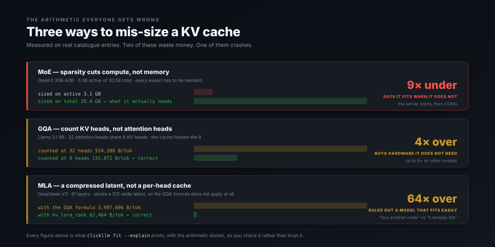

<div align="center">


# Is the open model<br>on par?

### Answered on your traffic, your hardware, your budget — per task, with confidence intervals, and a `?` where the evidence is too thin to say. Then served in one command, with no config file. Ever.

```bash
onpar run qwen3-30b-a3b
```

**Behind that one line: the KV cache sized without getting MoE, GQA or MLA
wrong; the right engine of seven chosen for the silicon you actually have; the
two dozen flags that matter set correctly; the weights resolved to a repo
confirmed to exist. You get an OpenAI-compatible endpoint and you never opened
an editor. When you need to know it is good enough — not on someone's
leaderboard, on your own captured requests — that is one more command, and it
answers per cluster with confidence intervals instead of a shrug.**

[](docs/50-roadmap.md)
[](#verification)
[](LICENSE)
[](https://dshakes.github.io/onpar/docs/)

**[Site](https://dshakes.github.io/onpar/) · [Docs](https://dshakes.github.io/onpar/docs/) · [Agent-first](#agent-first-by-construction) · [Why](#why-this-exists) · [Quickstart](#try-it-in-ten-seconds) · [Roadmap](docs/50-roadmap.md)**

</div>

## The problem

Your team pays a closed-model API. An open model would cost a fraction of
that, and the quality gap has closed — roughly 17.5 points of MMLU between
the best closed and best open model at the end of 2023, effectively zero on
knowledge benchmarks by 2026, with cost still running 6–62x apart.

So why is anyone still paying? Two questions nobody can answer for you:

1. **Will it even run on our hardware?** Between "the weights are on Hugging
   Face" and "it is serving" sits a specialist skill: KV cache arithmetic
   that goes wrong three separate ways, seven engines with incompatible flag
   dialects, quantisation that means something different on MLX than on vLLM,
   and memory maths that must saturate rather than silently wrap.
2. **Is it good enough for *our* traffic?** Benchmarks are someone else's
   exam. The model that tops MMLU may fail your extraction schema, and the
   one ranked fortieth may be perfect at your four tasks.

onpar answers both — on your hardware, on your traffic — and prints the
arithmetic so you can check it rather than trust it.


## Try it in ten seconds

```bash
uvx --from onpar onpar fit
```

No install, no config file, no account, no telemetry. It reads the machine
it is running on and tells you what fits:

```

  M4 Max · 16 cores · 128 GB · 546 GB/s
  usable for inference: 96 GB

  FEASIBLE at 32,768 context, concurrency 8

  model                     quant   weights      kv   total    free  ~tok/s  license
  ----------------------------------------------------------------------------------------
  Qwen3 32B                 q4        17.2G   64.0G   84.1G   11.9G      15 slow  Apache-2.0 OK
  Qwen3 30B-A3B (MoE)       q8        28.4G   24.0G   56.2G   39.8G      60  Apache-2.0 OK
  Mistral Small 24B         q8        22.0G   40.0G   65.2G   30.8G      14 slow  Apache-2.0 OK
  Phi-4 14B                 q8        13.7G   50.0G   66.3G   29.7G      18  MIT OK
  Llama 3.1 8B              q8         7.5G   32.0G   41.6G   54.4G      32  Llama 3.1 !

  NOT FEASIBLE

  Gemma 3 27B               weights fit (14 GB) but KV at 32,768 ctx x8 (124 GB) puts it 45 GB over the 96 GB available
  Llama 3.3 70B             weights fit (37 GB) but KV at 32,768 ctx x8 (80 GB) puts it 25 GB over the 96 GB available
  Qwen3 235B-A22B (MoE)     weights alone need 123 GB at q4 — MoE sparsity (22B of 235B active) cuts compute, not memory
  DeepSeek V3 (MoE, MLA)    weights alone need 352 GB at q4 — MoE sparsity (37B of 671B active) cuts compute, not memory
  GLM-5.2                   weights alone need 186 GB at q4 — MoE sparsity (32B of 355B active) cuts compute, not memory
  Kimi K2.7 Code            weights alone need 524 GB at q4 — MoE sparsity (32B of 1000B active) cuts compute, not memory
  Kimi K3 (2.8T MoE)        weights alone need 1,467 GB at q4 — MoE sparsity (50B of 2800B active) cuts compute, not memory
  DeepSeek V4 Pro           weights alone need 838 GB at q4 — MoE sparsity (45B of 1600B active) cuts compute, not memory
  MiniMax M3                weights alone need 239 GB at q4 — MoE sparsity (46B of 456B active) cuts compute, not memory

  runtime -> mlx
             Apple silicon: the CUDA engines cannot run here at all. MLX has the better
             batching story of the two Metal options.

  onpar fit --explain <model-id>   # show the arithmetic
```

Every number carries its arithmetic. `onpar fit --explain <model-id>`
shows the derivation for any row — weights, KV, overhead, headroom.

### Ask it in English instead

Run `onpar` bare and describe what you are building. It asks a question
only when the answer would change the plan, and in a script or a CI step the
same invocation stays a usage error rather than waiting on input:


## The three ways sizing goes wrong

This is the arithmetic the tool exists to get right, and all three errors
are common in the wild:



- **MoE** sizes on *total* parameters. Kimi K3 activates 50B of 2.8T per
  token, so people assume it needs 50B resident. All 2.8T must be. Sparsity
  cuts compute, not memory.
- **GQA** uses `kv_heads`, not attention heads — up to an 8× overestimate.
  The model fits; the naive tool says it does not.
- **MLA** (DeepSeek family) stores one compressed latent, not per-head K/V.
  Applying the GQA formula overestimates KV by ~50×.

And one that costs money in the other direction: **speculative decoding
turns negative past batch ~32.** EAGLE-3's headline "2–3×" is a
single-stream figure.

## Then: is it good enough for your traffic?

Sizing tells you what *runs*. The harder question is whether it is good
enough — and that is answered on your own captured requests, per task,
against the closed model you use today:

```
                    Arithmetic  Ticket classific  Structured extra  One-line summari
llama-3.1-8b      98% [87–100]       90% [77–96]     100% [91–100]      98% [91–100]
gpt-4o-mini               100%              100%              100%              100%
```

Every cell is a Wilson score interval, and a task counts as proven only when
its **whole interval** clears the bar — so a small sample cannot promote
itself by getting lucky. At a perfect score you need 35 flawless items to
clear 90%, and no fewer, however clean 12 looks. A cell with too little
evidence prints `?` rather than a fabricated score, and the judge model and
human-agreement rate are disclosed in every report.

**Where the candidate loses is printed first.** The honest failure is what
makes the wins credible.


### The eval suite, and why it refuses more than it reports

Evals are the half of this product that decides whether you move at all, so
they are built to disappoint you honestly:

- **Your traffic, not a benchmark.** Eval items are distilled from captured
  requests and clustered into task shapes. A model is scored on the work you
  actually send, per shape, because a model that is excellent at one of your
  tasks and useless at another must not be averaged into "fine".
- **Confidence intervals, never bare scores.** Wilson intervals throughout.
  A task is proven only when its whole interval clears the bar.
- **`?` beats a fabricated number.** Too little evidence prints `?`. Never a
  number the sample cannot support.
- **The judge is disclosed.** Judge model and human-agreement rate appear in
  every report — an unlabelled judge is an unfalsifiable claim.
- **Failures are cached as failures.** `--resume` re-buys only what is
  missing; an item that failed is an item to retry, never a cached success.
- **A judge alone never promotes.** Nothing authorises a cutover except
  shadow mode against live traffic.

## What it costs, and how sure you can be

The same migration, costed three times at different evidence levels — the
interval narrows as the sample grows, and the saving is stated with it:

 Without a rate, a capture

Give it what the incumbent costs and it prices the migration — with the
saving stated as a range, because the evidence is a range:

```bash
onpar prove evalset.json --incumbent-cost 2847 --candidate-cost 317 \
    --traffic-window '14 days'

  Saving: $2,506–$2,530/mo (~89%) on traffic proven at or above the 90% bar
    100% [99–100] of traffic moved, measured on 400 captured requests
    over 14 days; Wilson score, 95%
```

## The whole loop, on one machine

Everything above is one chain, and it runs on a laptop. This is a real run:


Capture starts with an explicit command, in your request path, until Ctrl-C:

```bash
onpar observe --upstream https://api.openai.com/v1

  In your request path from now until Ctrl-C, and not after (ADR-0015).
  capture   ~/.onpar/captures.log (key: ~/.onpar/capture.key)
  upstream  https://api.openai.com/v1
  listening http://127.0.0.1:8787
  point your base_url at http://127.0.0.1:8787/v1 and nothing else changes.
```

Redaction runs *inside* the write path, so there is no code path that
appends a record which skipped it — and a redaction failure drops the
capture rather than writing it. Zero telemetry and zero egress by default:
captured traffic is the most sensitive data a customer has, so export is an
explicit command, never a background sync.

Nothing authorises a cutover except shadow mode. An LLM judge alone never
moves production traffic.

### The receipt

A proof you cannot audit is a rumour. Every verdict emits a receipt — what
was compared, on how much evidence, under which judge, and what would
invalidate it:


A receipt goes stale on its own terms: `onpar guard` voids it when the
model fingerprint changes behind its name, or when traffic drifts into
shapes that were never scored.


### Resume, because a killed run should not be bought twice


## Agent-first, by construction

The same engine is a CLI, an MCP server, a Python SDK and a workbench —
one core, four surfaces, no wrapper around a subprocess:



```jsonc
// onpar-mcp — JSON-RPC over stdio, zero dependencies
onpar_fit       // what runs on this machine, at this context and concurrency
onpar_explain   // the full arithmetic behind one verdict — weights, KV, headroom
onpar_where     // the inverse: which hardware would run this, and at what cost
onpar_catalog   // parameters, MoE split, context, licence
onpar_advise    // what to change unprompted, and where production diverged
onpar_build     // the whole flow, multi-turn: pass state back to continue
onpar_distill   // captured traffic -> an eval set, so there is something to prove against
onpar_prove     // run the eval suite: verdict, traffic split, and a receipt
onpar_receipt   // read a proof: what is proven, what must stay, what is unknown
onpar_guard     // does that proof still hold — and if not, which of three ways
```

No tool in that registry can move production traffic, and adding one fails
the build. The vocabulary is deliberately broad: the failure it guards
against is an agent promoting a model because a helpful-looking
`onpar_promote` existed and nothing objected.

## What runs today

Pre-alpha, and honest about which parts are real:


Full acceptance criteria and risk gates: **[implementation plan](docs/80-implementation-plan.md)**.

## What it is not

**Not a load balancer.** Not an inference engine, not a chat UI, not a RAG
framework, not hosted inference. Those have incumbents and none of them is
the gap.

The gateway is in your request path only while you are migrating, and not
after — reasoning in
[ADR-0015](docs/adr/0015-in-the-path-only-while-migrating.md).

Generated config is **native and standalone** — a real `vllm serve` or a
real `InferencePool` that runs with onpar uninstalled. Never a wrapper.

## Why this exists


Every layer of this stack has a good incumbent. The gap is the seam between
them: nobody proves an open model is good enough for *your* traffic and
then moves you across with a rollback button.

## Architecture

**Rust** for the datapath — no GC pauses against a p95 budget, explicit accounting for GB-scale fleet memory. The budget is 15 ms added p95 (NFR-1); the measured figure is **+0.07 ms** with capture on, and the test that measures it also proves it can detect 25 ms of injected delay, because a latency check that passes by measuring nothing is the most comfortable green there is. **Python** for the control plane, where the ML ecosystem lives. Reasoning and rejected alternatives in [ADR-0007](docs/adr/0007-tech-stack.md).

## Install

```bash
uvx --from onpar onpar fit           # no install, no deps
pip install onpar                       # or install it
npx onpar-cli@1.3.2 fit                        # same build, via npm
onpar version                              # what you have, and where it came from
```

**`fit` is one package. The evidence half is three.** `onpar` alone sizes models
and needs nothing else — that is deliberate, so `uvx onpar fit` works on a machine
with no install. Capturing and scoring your own traffic needs two more:

```bash
pip install onpar onpar-gateway onpar-core   # observe, distill, prove
```

`onpar-gateway` is the capture proxy; `onpar-core` is the compiled extension that
reads captures back. Without them `onpar observe` refuses to start and `onpar
distill` cannot read what was captured — both say so, and name the package, rather
than failing later or quietly writing something unreadable.

The commands above are unpinned and fetch the newest release — currently **1.3.2**.

The `==` is exact on purpose: `npx onpar-cli@1.3.2` runs `onpar` 1.3.2 and nothing else.
Pin it when you need a build to stay put:

```bash
uvx --from onpar==1.3.2 onpar fit   # exactly this build
```

`onpar version` reads the installed metadata rather than a string someone typed —
through 0.1.4 the receipts it writes were stamped `0.1.0`, because that literal had been
hand-written once and never moved. Fixed in 0.1.5, so a receipt now names the build that
produced it.

`onpar fit` has zero runtime dependencies and works under `uvx` with
nothing installed; a test fails if anything networked is even imported.

## Verification

```bash
cargo test --all                                   # 251 Rust
cargo clippy --all-targets -- -D warnings
uv run --with pytest --with pyyaml --python 3.13 pytest -q   # 2007 Python
```

**2258 tests.** 2007 Python, 251 Rust. Twenty-three of the Python tests skip on a
bare machine. Eleven are environmental: nine need the compiled extension (`maturin
develop` in `onpar-py/` turns them on), and two ask vLLM and SGLang for their
own flags, which needs those engines installed. CI runs both inside the engines'
published images, so neither skip reaches a green tick unasked. The other twelve
are the mutation harness reporting honestly that it had nothing to do: those
modules declare no numeric constant to perturb, so there is nothing to mutate.
Every module's `demo()` is *run* by a separate test, because that harness used
to skip when a demo failed — which is how two of them sat broken behind a green
tick. The Rust core denies `unwrap`/`expect`/`panic!`/slice-indexing at the lint level — a sizing or licence bug must not be a panic. Gateway tests run over **real TCP** against a **real** upstream, because a test that calls the handler directly passes even when the response is buffered.

```bash
cargo test --all                                   # 251 Rust
cargo clippy --all-targets -- -D warnings
uv run --with pytest --with pyyaml --python 3.13 pytest -q   # 2007 Python
```

Every module carries an assert-based `demo()` self-check runnable via
`python -m onpar.<mod>`. The Rust core denies `unwrap`/`expect`/`panic!`
and slice-indexing at the lint level — a sizing or licence bug must not be a
panic — and sizing arithmetic saturates, so an overflowed requirement reads
as "too big" and refuses rather than wrapping to a small number and
appearing to fit. Gateway tests run over **real TCP** against a **real**
upstream, because a test that calls the handler directly passes even when
the response is buffered.

## Docs

| | |
|---|---|
| [00 — Verdict](docs/00-verdict.md) | Build vs. buy, honestly. |
| [10 — Landscape](docs/10-landscape.md) | 14 competitors across 4 layers. |
| [20 — PRD](docs/20-prd.md) | Goals, personas, FR/NFR, epics, risks. |
| [30 — Architecture](docs/30-architecture.md) | Datapath/control-plane split, grader stack, fit math. |
| [40 — UX](docs/40-ux.md) | CLI, TUI, console, MCP. |
| [50 — Roadmap](docs/50-roadmap.md) | What is shipped, what is next, what is out of scope. |
| [60 — Pitch](docs/60-pitch.md) | The argument in one pass, for someone deciding. |
| [70 — Naming](docs/70-naming.md) | Why it is called this. |
| [80 — Plan](docs/80-implementation-plan.md) | M0–M10, acceptance criteria, risk gates. |
| [90 — CI gating](docs/90-ci-gating.md) | Gate a deploy on a proof that still holds. |
| [95 — GA readiness](docs/95-ga-readiness.md) | What is ready, what blocks GA, ranked — assessed by running the published packages. |
| [ADRs](docs/adr/) | 19 decisions, including the two later reversed. |

The docs teach the whole inference stack from first principles —
[start here](https://dshakes.github.io/onpar/docs/#edu-why) if you have
never sized a KV cache.

## License

Apache-2.0. See [LICENSE](LICENSE).
